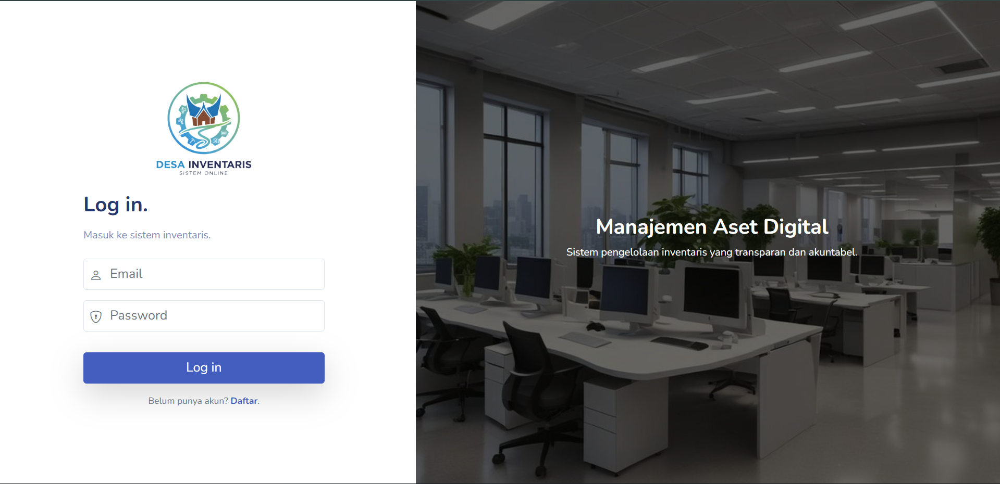
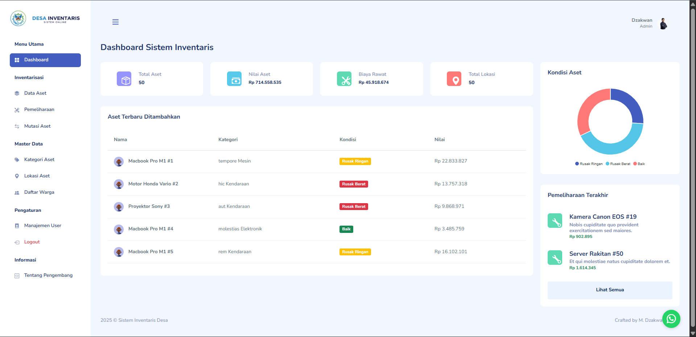
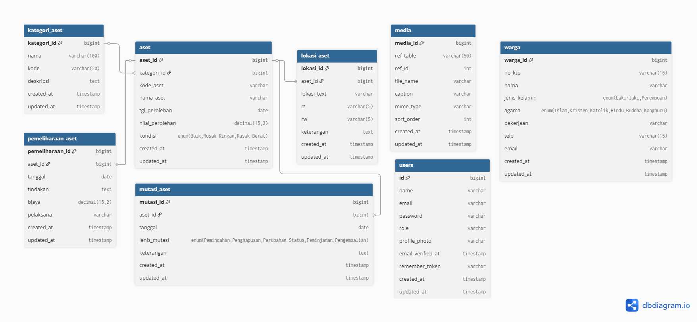

# Sistem Informasi Inventaris Aset Desa (Bina Desa)


Sistem Informasi Inventaris Aset Desa adalah aplikasi berbasis web yang dirancang untuk mendigitalisasi proses pencatatan, pemantauan, dan pelaporan aset milik desa. Sistem ini menggantikan pencatatan manual dengan *database* terpusat yang transparan dan akuntabel.

Project ini dikembangkan sebagai bagian dari tugas **Finalisasi Project Mata Kuliah Pemrograman Framework**.

## 📸 Screenshots

| Halaman Login | Dashboard Statistik |
|:---:|:---:|
|  |  |
| *Tampilan login dengan keamanan enkripsi dan validasi role pengguna.* | *Dashboard interaktif menampilkan total aset dan grafik kondisi barang.* |


## ✨ Fitur Unggulan

### 1. Manajemen Aset Terpadu
- **CRUD Aset Lengkap:** Input data aset detail (Kode, Harga, Tanggal Perolehan, Kondisi).
- **Galeri Foto:** Upload foto aset.
- **Kategorisasi:** Pengelompokan aset berdasarkan kategori dan lokasi (RT/RW/Ruangan).

### 2. Transaksi & Riwayat (Tracking)
- **Mutasi Aset:** Mencatat perpindahan lokasi, perubahan kondisi (Baik -> Rusak), atau penghapusan aset.
- **Pemeliharaan (Maintenance):** Mencatat riwayat servis aset lengkap dengan biaya dan **Multiple File Upload** (Bukti Nota/Foto Pengerjaan).

### 3. Keamanan & Hak Akses (RBAC)
Sistem membedakan hak akses menggunakan **Middleware** untuk 3 tipe pengguna:
- **Administrator:** *Full Access* (Kelola User, Master Data, CRUD Aset, Laporan).
- **Staff Inventaris:** Fokus operasional (Input Aset, Mutasi, Pemeliharaan).
- **Kepala Desa (Kades):** *Read-Only* (Hanya bisa melihat Dashboard statistik dan Detail Aset untuk monitoring).

### 4. Fitur Teknis Lainnya
- **Dashboard Statistik:** Grafik visual total aset dan kondisi barang.
- **Filter & Pencarian:** Server-side filtering untuk menangani data besar.
- **Cetak Laporan:** Export data aset dan riwayat mutasi.

## 🗂️ Struktur Database (ERD)

Sistem ini menggunakan basis data relasional yang kompleks. Berikut adalah desain **Entity Relationship Diagram (ERD)** yang digunakan:



*Keterangan: Relasi mencakup tabel Users, Aset (Inti), Mutasi, Pemeliharaan, dan Media (Polymorphic).*

## 🛠️ Teknologi yang Digunakan

- **Framework:** Laravel 11 (PHP 8.2+)
- **Database:** MySQL
- **Frontend:** Blade Templating + Bootstrap 5
- **Template Admin:** Mazer Dashboard

## 🚀 Cara Instalasi (Localhost)

Ikuti langkah-langkah berikut untuk menjalankan project di komputer lokal:

1. **Clone Repository**
   ```bash
   git clone (https://github.com/dzakwan24si/inventaris-admin.git)
   cd nama-repo